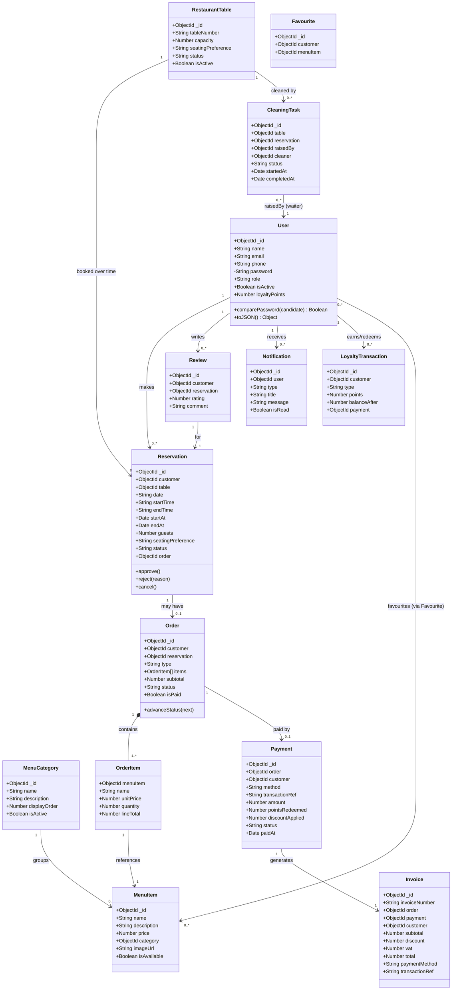

# DineEase — Class Diagram (§14)

Software-generated (Mermaid) class diagram of the domain model. Render on GitHub,
in VS Code (Markdown Preview Mermaid), or at <https://mermaid.live>.

## Relationship summary

- One **User** → many **Reservations**, **Reviews**, **Notifications**, **LoyaltyTransactions**.
- One **MenuCategory** → many **MenuItems**.
- One **RestaurantTable** → many **Reservations** (over time) and **CleaningTasks**.
- One **Reservation** → zero or one **Order**.
- One **Order** → many **OrderItems**; each **OrderItem** → one **MenuItem**.
- One **Order** → zero or one **Payment**; one successful **Payment** → one **Invoice**.
- **Users** ↔ **MenuItems** many-to-many through **Favourite**.
